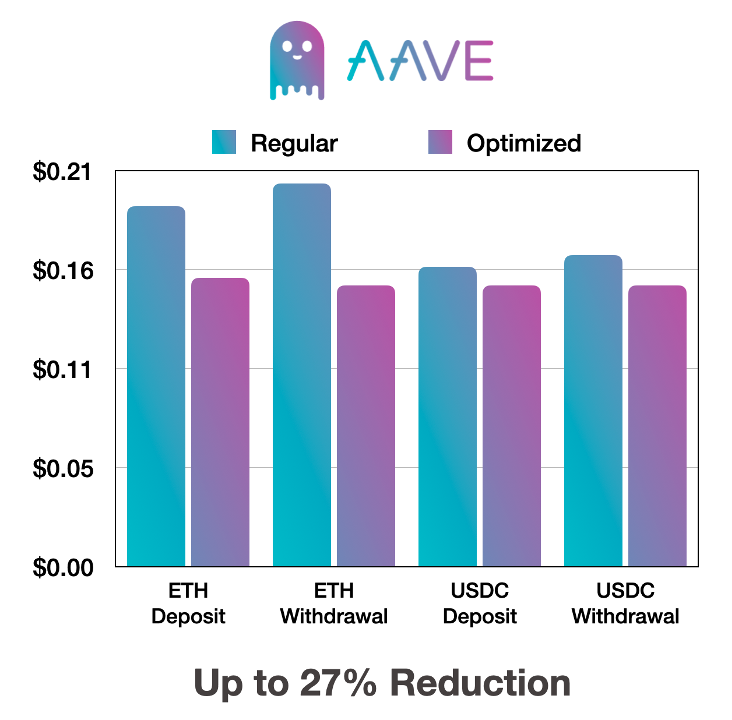

# L2 Optimizoooors

  

  <b>Contracts that use as little calldata as possible in order to save gas on L2s.</b>

  

- [Overview](#overview)
- [Benchmarks](#benchmarks)
- [Deployments](#deployments)
  - [Aave](#aave)
  - [Superfluid](#superfluid)
  - [Connext](#connext)
- [How it Works](#how-it-works)
- [Get in Touch](#get-in-touch)

## Overview

Layer 2 networks share security with mainnet by posting transaction calldata to Layer 1.
As a result, Layer 2 users pay their portion of the mainnet gas costs when executing transactions.
Layer 1 gas can be >25,000x more expensive than Layer 2 gas, so paying for calldata dominates L2 transaction costs.
With custom contracts that use less calldata than standard methods we significantly reduce transaction costs for users.

The frontend for this project can be found [here](https://github.com/ScopeLift/l2-optimizoooors-frontend).

## Benchmarks

This repo contains calldata-optimized routers for three protocols: Aave, Connext, and Superfluid.
Savings for each are shown in the images below.
The same data can be found in [this spreadsheet](https://docs.google.com/spreadsheets/d/1Ix97LDMRnT-ENO5i_nCNk2lVcp6kzua9Mrh7Dk8038E/edit#gid=0).

  
  
  

## Deployments

The contracts in this repo are deployed to the following addresses and chains.

### Aave

| Contract             | Chain    | Address                                                                                                                          |
| -------------------- | -------- | -------------------------------------------------------------------------------------------------------------------------------- |
| Aave, Router Factory | Optimism | [0xc541372C68bcDBDF20561155AAfcEE400D8Bc053](https://optimistic.etherscan.io/address/0xc541372C68bcDBDF20561155AAfcEE400D8Bc053) |
| Aave, Deposit ETH    | Optimism | [0x234B85b4C37760BC9C9B7545201edE4276dE6dF8](https://optimistic.etherscan.io/address/0x234B85b4C37760BC9C9B7545201edE4276dE6dF8) |
| Aave, Withdraw ETH   | Optimism | [0x5F7ca09FD143e24e3AFbC90C842F0882c9ED7053](https://optimistic.etherscan.io/address/0x5F7ca09FD143e24e3AFbC90C842F0882c9ED7053) |
| Aave, Deposit DAI    | Optimism | [0x0c370E22669c477391fC4a2F65f314270e16e131](https://optimistic.etherscan.io/address/0x0c370E22669c477391fC4a2F65f314270e16e131) |
| Aave, Withdraw DAI   | Optimism | [0xd3077F0bbC9A9A0e63B56Fd0A7d98e5F5286c805](https://optimistic.etherscan.io/address/0xd3077F0bbC9A9A0e63B56Fd0A7d98e5F5286c805) |
| Aave, Deposit USDC   | Optimism | [0x8cb9894F3F5fC6b2554553cb0F0ae40474A142dF](https://optimistic.etherscan.io/address/0x8cb9894F3F5fC6b2554553cb0F0ae40474A142dF) |
| Aave, Withdraw USDC  | Optimism | [0xbD46B51e1Ebe7f61FBA5Ad5d4650F847f3F65bAD](https://optimistic.etherscan.io/address/0xbD46B51e1Ebe7f61FBA5Ad5d4650F847f3F65bAD) |

## Superfluid

| Contract                   | Chain          | Address                                                                                                                               |
| -------------------------- | -------------- | ------------------------------------------------------------------------------------------------------------------------------------- |
| Superfluid, Router Factory | Optimism       | [0xE41A0678b7C07a92543Ca10927c568DBddca915d](https://optimistic.etherscan.io/address/0xE41A0678b7C07a92543Ca10927c568DBddca915d)      |
| Superfluid, Wrap USDC      | Optimism       | [0xeD3d36dD725b6Eb4bd996b09ac1130E45a3360dD](https://optimistic.etherscan.io/address/0xeD3d36dD725b6Eb4bd996b09ac1130E45a3360dD)      |
| Superfluid, Stream USDC    | Optimism       | [0x4055B2dd05E28399bd44fDe4dE6D64AF29c6F47f](https://optimistic.etherscan.io/address/0x4055B2dd05E28399bd44fDe4dE6D64AF29c6F47f)      |

## Connext

Connext v2 is not yet in production, which is why it's only deployed to Görli.

| Contract                   | Chain          | Address                                                                                                                               |
| -------------------------- | -------------- | ------------------------------------------------------------------------------------------------------------------------------------- |
| Connext, Router Factory    | Optimism Görli | [0xCdC50DB037373deaeBc004e7548FA233B3ABBa57](https://goerli-optimism.etherscan.io/address/0xCdC50DB037373deaeBc004e7548FA233B3ABBa57) |
| Connext, Bridge Test Token | Optimism Görli | [0xa050e4F3B5f0cE4cfe519C5545E7AA73e1B6c323](https://goerli-optimism.etherscan.io/address/0xa050e4F3B5f0cE4cfe519C5545E7AA73e1B6c323) |

## How it Works

Every protocol has a factory contract which deploys the calldata-optimized routers for that protocol.
The factory deploys a unique contract for every combination of methods and parameters that can be hardcoded

For example, with Aave:
- Deposing ETH into Aave has a dedicated contract.
- Withdrawing ETH from Aave has a dedicated contract.
- Depositing USDC into Aave has a dedicated contract.
- And so on.

And similarly for Connext and Superfluid.

This means users don't need to specify a function selector, which saves 4 bytes of calldata.
This also means users don't need to specify a token address, saving another 32 bytes (20 bytes of non-zero calldata).

Aave lets you specify where to send the receipt tokens (on deposit) or the asset itself (on withdraw).
Similarly, Connext lets you specify where to send the asset once bridged.
For both of these we assume the user wants to send the asset to themselves so a recipient address is not required, which again saves 32 bytes (20 bytes of non-zero calldata).

Aave, Connext, and wrapping tokens in Superfluid require you to specify an amount of tokens.
Instead of specifying exact amounts, users specify amounts as percentages of their balance.
If zero bytes of calldata are provided, the full user's balance is used.
Any non-empty calldata provided is considered the numerator of a fraction, such that:

- If one byte of calldata is provided the denominator is 255, which is the max value of a single byte.
- If two bytes of calldata are provided the denominator is 65,535, which is the max value of two bytes.
- And so on.

From there, we compute the amount to use as `userBalance * calldata / denominator`.
This lets you specify nearly any amount of tokens with just a few bytes of calldata.
The tradeoff is precision: you may not be able to send *exactly* one token, and must tolerate a small deviation in the amount.

Some protocols may deem this tradeoff unacceptable, and others require rates or other parameters that don't work with this pattern.
One such case is creating a flow on Superfluid, which requires specifying a flow rate.
In these cases, the user specifies the amount as normal, but with all zero-padding removed.
If you wanted to specify a value of 100e6 with this method, the calldata would be `0x05f5e100`.
This is just 4 bytes, instead of the standard 32 bytes used by ABI-encoding.

## Get in Touch

If you are interested in having gas-optimized routers written for your protocol, please [reach out](https://www.scopelift.co/contact) to us!
